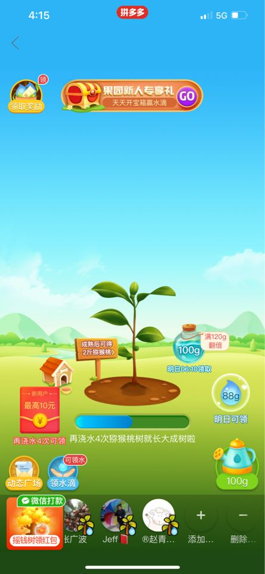
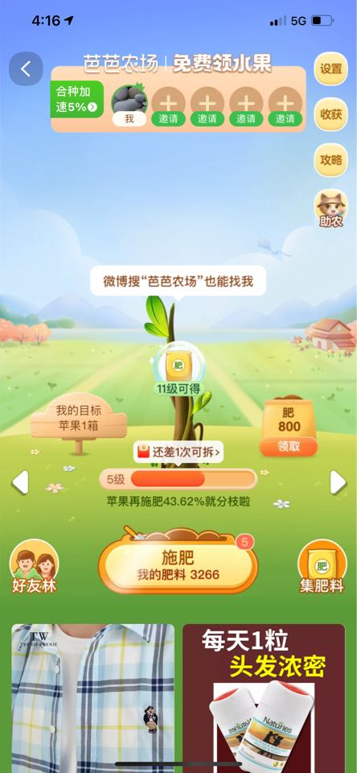
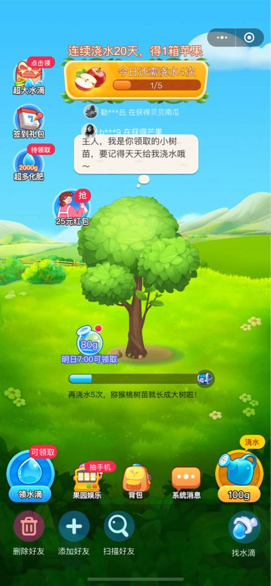
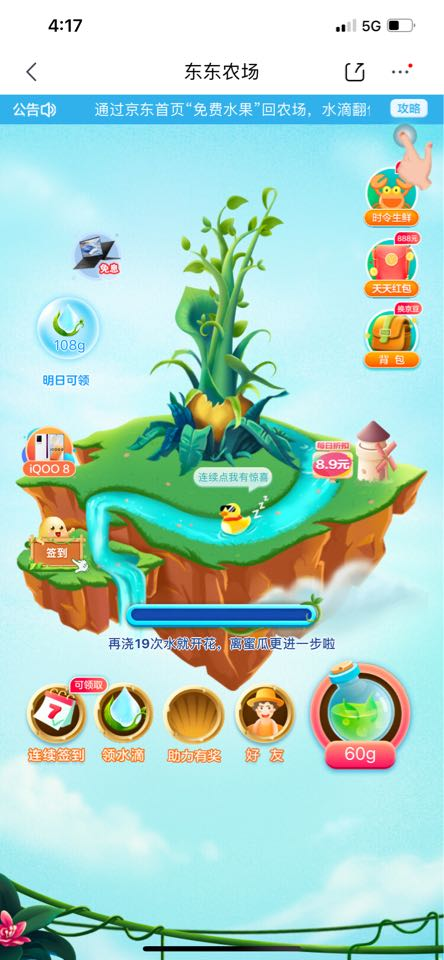
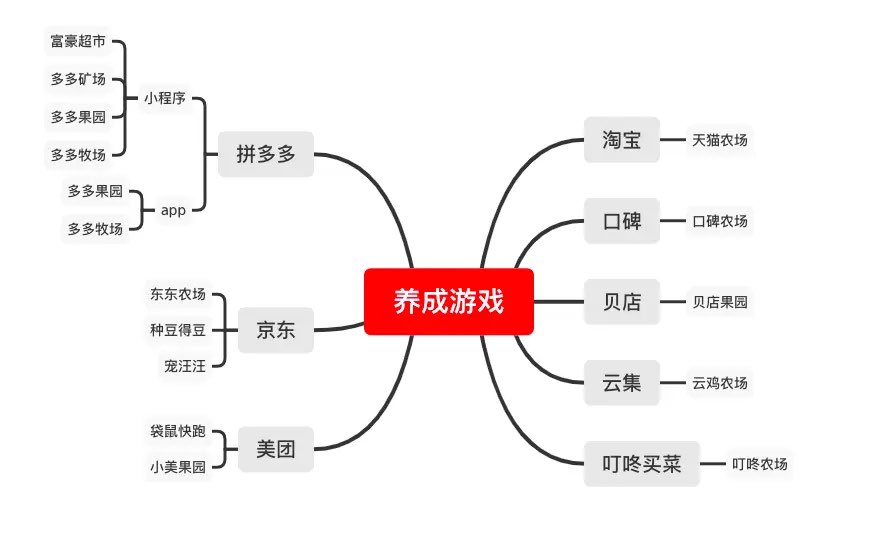
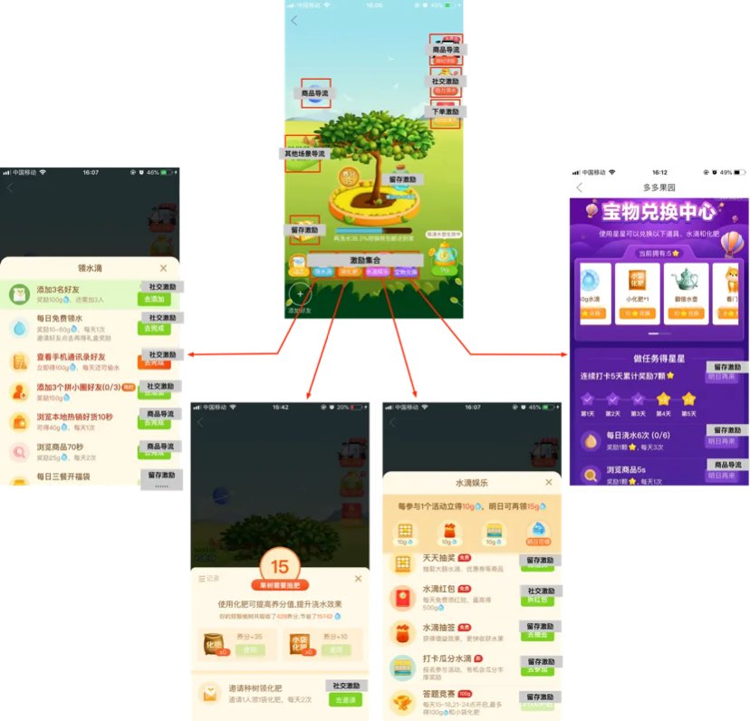
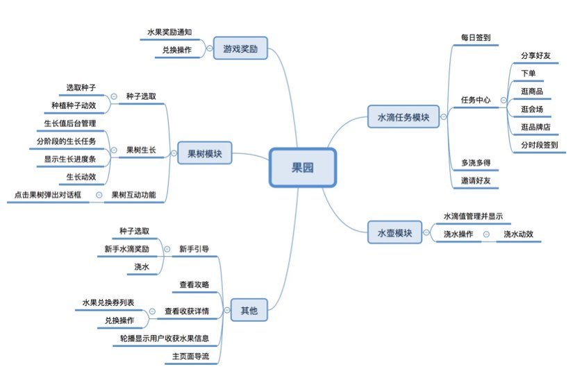

[TOC]

--- 

<h1 style="text-align:center;color:#BB5500">农场养成类游戏调研报告</h1>

### 一、简述
多多果园是拼多多内的一个养成游戏，点击进去，会让你选择一种水果进行种植。通过分享、浏览、成单等行为获得水滴，每天浇水灌溉，看着自己种的水果，从种子开始发芽，慢慢长成一株果树。最重要的是，开花结果之后，拼多多会给你免费寄来一箱你所种的水果。

#### 1. 流量来源
- APP**首页icon**和**我的功能icon**入口
- 通过游戏内分享获得

#### 2. 任务体系
主要是通过任务获取加速奖励，而主要的奖励集中在浏览指定页面和下订单的方式。最终使我们能达到拉新、引流、促活、粘客、产品营销等各类目标

#### 3. 任务进度
用户可以通过分享组队、下单等行为来加速成长，统计显示大部分需要**15天~90天**左右的时间成本。

#### 4. 奖品
各个平台基本上基本都是2~3斤的水果之类，价值大概在**10元以下**。

#### 5. 功能模块与mvp版本要求

| 模块       | 功能点                                                             | MVP | 备注                                                                                                           |
| ---------- | ------------------------------------------------------------------ | --- | -------------------------------------------------------------------------------------------------------------- |
| 新手引导   | 引导新手体验                                                       | Y   | 水果评价、了解核心玩法：登录等任务领水滴，水滴浇水果树成长，最终成熟领取水果                                   |
| 登录奖励   | 每日登录，连续登录，累计N天登录                                    | Y   | 提高后续次日N日留存                                                                                            |
| 邀请助力   | 邀请好友同玩领水果                                                 | Y   | 站外私域引流                                                                                                   |
| 果树       | 成长阶段                                                           | Y   | 幼苗、大树、开花、结果、成熟5阶段，共需约4000次浇水（淘宝芭芭农场分15阶段，估计总浇水次数略大于4000次）        |
| 果树       | 点击互动                                                           | Y   | 点击果树互动消息（初期文案、水滴等，后续考虑增加营销卡券、任务等）                                             |
| 果树       | 消息提示                                                           | N   | 未读/重要消息提示（支持果树主动弹出，如升级提醒、浇水邀请、营销卡券使用提醒、任务完成提醒）                    |
| 进度条     | 果树每个阶段内的进度提醒                                           | Y   | 次数/进度百分比                                                                                                |
| 浇水       | 点击浇水                                                           | Y   | 浇水按钮、点击动效                                                                                             |
| 动态记录   | 记录查询                                                           | Y   | 果树浇水记录、奖励记录、好友邀请记录                                                                           |
| 领水滴     | 开启种树送水滴                                                     | Y   | 果树活动页面展示任务，点击去对应操作界面，完成后可直接返回果树活动，立即领取水滴（任务需可准实时完成）（下同） |
| 领水滴     | 浇水送水滴                                                         | Y   |                                                                                                                |
| 领水滴     | 登录送水滴                                                         | Y   |                                                                                                                |
| 领水滴     | 分享活动邀请好友送水滴                                             | Y   |                                                                                                                |
| 领水滴     | 看产品/产品列表送水滴                                              | Y   |                                                                                                                |
| 领水滴     | 连续浇水（次数）送水滴                                             | Y   |                                                                                                                |
| 领水滴     | 连续浇水（天数）送水滴                                             | Y   |                                                                                                                |
| 领水滴     | 购买产品（完成提交申请）送水滴                                     | Y   |                                                                                                                |
| 领水滴     | 看资讯送水滴                                                       | Y   |                                                                                                                |
| 领水滴     | 充值任意金额送水滴                                                 | Y   |                                                                                                                |
| 领水滴     | 关注公众号送水滴                                                   | Y   |                                                                                                                |
| 领水滴     | 加好友送水滴                                                       | N   |                                                                                                                |
| 领水滴     | 开启合种送上水滴                                                   | N   |                                                                                                                |
| 领水滴     | 合种队伍扩大送水滴                                                 | N   |                                                                                                                |
| 领水滴     | 合种好友浇水送水滴                                                 | N   |                                                                                                                |
| 领水滴     | 好友互动送水滴                                                     | N   |                                                                                                                |
| 领水滴     | 下单后连续N日送水滴                                                | N   |                                                                                                                |
| 领水滴     | 等级用户送水滴（会员权益）                                         | N   |                                                                                                                |
| 领水滴     | 访问/参与其他活动送水滴（视节点活动推广需要）                      | N   |                                                                                                                |
| 领水滴     | 扶贫助农公益送水滴（会员商城增加公益商品）                         | N   |                                                                                                                |
| 好友       | 加好友                                                             | N   |                                                                                                                |
| 好友       | 合种                                                               | N   |                                                                                                                |
| 好友       | 去好友果园、偷水、帮浇水、留言                                     | N   |                                                                                                                |
| 微信提醒   | 关注公众号后，公众号推送果树提醒                                   | N   |                                                                                                                |
| 宝箱       | 点击果树/浇水中随机触发奖励，可发放水滴、营销卡群、任务等          | N   |                                                                                                                |
| 新用户专享 | 新客专享产品/任务引导宝箱任务（新客首投转化产品活动）              | N   |                                                                                                                |
| 果园讲堂   | 特产商品，公益商品，含视频介绍                                     | N   |                                                                                                                |
| 水壶特效   | 水壶对浇水效果增益，不同阶段差异化                                 | N   |                                                                                                                |
| 肥料特效   | 对土壤施肥，有效期分阶段提升浇水效果，包含获取肥料任务、库存和使用 | N   |                                                                                                                |

#### 6. 种水果任务简单成本估算

| 阶段     | 树苗   | 大树         | 开花            | 结果 | 成熟  | 总计                                                      |
| -------- | ------ | ------------ | --------------- | ---- | ----- | --------------------------------------------------------- |
| 浇水     | 30     | 60           | 240             | 600  | 3,000 | 3930                                                      |
| 水果成本 | 5-25元 | 单次浇水成本 | 0.0013-0.0064元 | -    | -     | 注：完成一次普通任务可获取1-2次浇水机会，如登录浏览产品等 |

--- 

### 二、市场玩家
因为这类游戏市场上已经做了有几年了，市面上这类游戏的玩法还是机制，都高度类似，其中以拼多多的多多果园和美团的小美果园做的最好最全。

主要平台的相关产品及APP入口：
| 平台   | 游戏名称 | 首页icon入口 | 我的功能入口 |
| ------ | -------- | ------------ | ------------ |
| 拼多多 | 多多果园 | 免费领水果   | 多多果园     |
| 淘宝   | 芭芭农场 | 芭芭农场     | 芭芭农场     |
| 美团   | 小美果园 | 免费领水果   | 免费领水果   |
| 京东   | 东东农场 | 免费水果     | 东东农场     |

下面是相应的主界面截图：

 <left>———拼多多———————淘宝———————美团———————京东———</left>

> 市面上比较火的一些平台上面的养成游戏汇总（网上借鉴）：

--- 

### 三、为什么要做养成类游戏？
#### 1. 增长、流量进入瓶颈期，用户红利消耗殆尽

拉新的难度和成本已经很高了，企业的关注点开始放到留存、转化上面。

#### 2. 养成小游戏能显著提升用户核心行为

养成小游戏对于用户增长的AARRR流程都起到很大促进作用。
通过让人欲罢不能的游戏体验产生大量的点击和互动；
- 产生更多用户互动机会；
- 提升操作的通过率/点击率；
- 留住用户再慢慢转化；
- 发券/拉关注/品牌曝光/内容推荐。
- 以发券效果为例，通过互动去发优惠券对比静态去发优惠券，差距会在3-4倍甚至更高。

#### 3. 养成小游戏门槛极低，容易复制

门槛低，意味着用户更容易上手。
开发成本低，为什么不尝试呢？

---

### 四、多多果园

分析产品，当然要分析最好的，所以会以拼多多的多多果园为例。多多果园的养成游戏通过让人欲罢不能的游戏体验产生大量的点击和互动，从而产生更多用户互动机会，最终实现留住用户并慢慢转化的目的。

#### 多多果园的显著效果
> - 拼多多的“多多果园”正式上线不到 15 天，用户量就达近 4000 万，每天超 2 亿人使用，累计 200 万用户收到水果。
> - “多多果园”自上线以来，高峰期每天可以种树200多万棵。
> - 媒体报道显示，2020年第一季度，多多果园日活跃用户达到5000多万，比年初增加了1100万，每天送出的水果超过100万斤。2019年10月10日，褚橙与拼多多达成战略合作协议，用户在多多果园中通过浇水抽奖，就有几率获得褚橙种子，等果实成熟后，用户可以收到基地直供的实物褚橙。
> - 疫情期间，多多果园通过与用户互动娱乐的方式免费送水果，帮助一些贫困地区消耗水果库存，既为果农带来了收益，又为拼多多赢得了口碑。

#### 多多果园页面
多多果园设计了两种基础元素：水滴和化肥。浇水使得果树生长，化肥能够加速果树生长。多多果园还做了多场景的延伸扩展。水滴和化肥除了由果园里的每日任务获得，通过积攒星星也可以兑换水滴、化肥和特效道具。同样在多多农场里收获的金币也可以兑换水滴和化肥。

果园的每次浇水会有一定的等待时间。随着果树的生长，时间间隔逐渐增加。起初等待时间是8s，不会引起用户太多的抗拒。随着果树生长，增长到15s，用户已经适应了8s的等待间隔。虽然感受到了时间有些长但还是可以接受，并且此时已经长出了果实。最后增长到33s，此时即使用户觉得等待时间过长，也不会轻易放弃游戏，因为已经付出了很多时间，眼见就能收获水果。

多多果园在浇水等待时间的设置，充分地抓住了用户的心理，促使用户多做任务兑换特效道具，减少等待时间，或者在等待的过程中浏览商品，进行购买。

另外，到了果树生长的后期阶段，化肥的作用开始突显。表现为养分的消耗速度加快，果树生长的速度变慢，需要及时补给化肥。在果树结果的后期，通过增强化肥的紧缺感和加大获取化肥的难度，从而诱导用户做出平台所期望的行为。

 

#### 多多果园产品结构
 

#### 多多果园功能分类
- 核心规则：养分规则、浇水规则；
- 用户活跃：观看直播、浇水、施肥、每日三餐时间开福袋、日签、偷好友水滴；
- 用户留存：第二日可领水/肥料、签到、瓜分、3日宝箱；
- 用户付费：浏览会场/商品、下单得水/肥料、拼单得水/肥料、拼单开宝箱、拼单抽奖、点击树会给优惠券；
- 用户分享：助力领水/肥料、答题、邀请好友得水；
- 给平台其他功能导流：促销活动、牧场、火车票、拼小圈、直播、大讲堂，这里面很多都是新的功能。

##### 核心规则
> 规则1：养分规则

官方：果树生长会吸收养分，吸收越多生长越快。只浇水不补充养分，果树生长会变慢。

- 养分需要用肥料去增加，大化肥+35，小化肥+15。
- 浇水的同时会降低养分，每次浇水会降低1~4点养分不等。
- 养分越多，浇水时获得的完成度越多，反之亦然。

> 规则2：浇水规则

通过各种手段获取水滴，然后给植物浇水。

植物生长分为几个阶段：

- 前期需要发芽（浇水5次）
- 开花（浇水20次）
- 结果(浇水60次)
- 成熟（至少浇水200次，实际不确定（根据养分决定），可能需要300次以上）

前期浇水按次数来计算，但是后期就是按百分比计算，而这个百分比，跟养分相关，养分越高，浇水获得的百分比越高。

这里面有一个很复杂的算法，参考别人统计是下表这样：

| 养分   | 每次浇水获得完成度% |
| ------ | ------------------- |
| 85-100 | 0.4%~0.5%           |
| 60-85  | 0.3%                |
| 40-60  | 0.2%                |
| <40    | 0.1%                |

所以用户需要保持水和肥料在一定区间，这就意味着用户需要完成大量的操作，获取肥料。
化肥的获取难度相比水滴大很多，这就意味着用户必须拼单或者拉新人才能完成。两种方式都让拼多多达到自己的目的。
整个任务完成的难度就大大提高，用户的生命周期随之延长。当然这其中必然伴随流失，这个是意料之中的。需要将利弊权衡之后，再作出决策。

#### 多多果园页面设计 
在页面设计这个部分可以分为主题，新手引导，弹窗，动效设计，这4个部分

【关于道具：】

道具在游戏中一般都起着推进主线任务的作用，因此道具也是数值设计中很大一部分变量，但产品中的养成游戏核心是帮助产品建立激励体系，提升产品某项指标，快速迭代更加重要，因此在前期只有“水滴”这一个道具，其他道具待数据模型完善后再根据需要逐步加入。

##### 1. 主题页面：

###### 1）视觉中心：以游戏的主体为视觉中心

为了让用户有参与感，在游戏中一般都会有一个用户可控制的主体，一些动作&竞技类游戏甚至会使用第一视角的方式去设计

###### 2）按钮布局：按照用户使用频次和功能优先级，从右向左，从上到下排序

大部分用户都是使用右手拿手机（据统计，左撇子在人群中仅占7%~10%）

###### 3）进度条设计：次数进度条用户给用户反馈更强，百分比进度条更方便调整数值

在前期可全部使用“次数”提示的进度条，给用户最强的反馈，尽快完善数据模型
后期可两种一起用，在前几个阶段使用“次数进度条”，最后一个阶段使用“百分比进度条”可实时调整任务难度控制成本            

##### 2. 新手引导：

新手引导的核心目主要有2点
- 1）让用户了解产品的使用
- 2）让用户体验到产品的核心价值 

对于第一点我们要尽量把核心功能加入到新手引导中，但要注意尽量尽量不要让用户跳出场景（用户跳入其他场景后很可能就不会再回来了）
跳出场景：用户跳出此流程（如：转发到微信，点击后跳转微信）
对于第二种我们可以把前期的里程碑（或者奖励）设计的简单一些，尽量让用户完成新手引导后就可以获得，一则可以让用户体验到产品的核心价值，二则可以利用用户“损失厌恶”的心理提高用户留存 

##### 3. 弹窗页面：

###### 1）弹窗页面尽量可以复用
对开发和设计师：可以减轻工作量，加快项目的进度
对用户：保持同类页面的统一性
（如：对于任务完成领取水滴的弹窗，可使用同一个弹窗，更改水滴的变量）

###### 2）一个时间的完成弹窗可作为另一个事件的入口

为给到用户更强的目标感，可在一个任务完成或者结束的弹窗中增加新的事件入口，引导用户去完成新的任务
（如：“多多果园”的领取水滴弹窗，会引导用户去完成助力领水的任务）

###### 3）在给用户选择的同时，增加“挽回弹窗”

在一些重要的引导流程中，为了保持好的用户体验，我们需要给用户“取消”的选择。
但是如果在用户选择取消的时候，增加一个获得型文案或损失厌恶文案的挽回弹窗，根据我们以往的项目经验，大概能减少10%~40的用户流失率
（如：”多多果园“中当用户选择退出的时候，会有弹窗提示“去xx还可以领取xx水滴”） 

##### 4. 动效设计：

一般主要有两种目的：引导行为，营造氛围

###### 1）引导行为

我们对于动态的东西，会比静态的关注度更高
而在产品设计中，往往会利用这一点去引导用户行为

###### 2）营造氛围

动态的内容往往会比静态的场景感更强，在游戏中一般会结合光效来提升氛围，增强视觉刺激，激发用户情绪
（如：用户打开礼盒时的动效有种“礼盒里面的东西要破盒而出的感觉”引导用户点击）

#### 多多果园场景建设
##### 1. 明确的奖励和低操作门槛

用户想法很简单，同样也很精明。他们自己会快速在脑中过一遍这件事的投入产出比，在得知每天动动手指点一点就能得到真实的水果后，会欣然加入。

为了提高用户的参与意愿，首先要考虑的是用户的行为成本，包括了游戏的参与入口是否明显、任务完成的可操作性是否够强、指定的用户行为是否简单、所需的心理成本和实际成本是否够低等。

在多多果园种树只需用户点击水滴浇水即可，操作简单，几乎无需消耗成本。邀请好友浇水的心理成本较高，但相应的奖励也更高；奖励一方面要要明显超出用户所需成本，另一方面要明确传达到用户认知里。比如多多果园里，果树下方总会有“距离成功所剩的次数”，刺激用户持续活跃。

##### 2. 结合产品的核心功能

多多果园拿出一定的物质价值与用户可能产生的商业价值进行交换。

平台结合产品的核心功能设计任务，将指定的用户行为与希望用户高频发生的行为尽量画上等号，从而创造最大收益；比如拼多多作为电商平台，GMV（交易总额）就是它最看重的核心指标之一。用户下单、收藏商品、加入购物车都是正向行为，是平台鼓励的行为，因此都会获得水滴。

##### 3. 构造合理的积分系统

积分是一个抽象概念，即完成了相应的任务得到的中间奖励，例如在多多果园下单后平台发放的水滴就是积分。中间奖励，意即它不是用户的最终目标，它是用户要获得最终奖励的中间媒介；之所以加入了这个中间媒介，一方面是通过数字化的形式更清晰量化等级和权益，另一方面也能让用户成长阶段的区隔更为灵活。

多多果园中合理设计哪些任务能赢得积分，每个任务相应分别能赢多少积分，实时发放还是周期性发放等规则。用户能够明确感知到积分的奖励规则和条件。同时积分最终能兑换水果也动态而清晰地展现在用户眼前。

##### 4. 加入与好友关系有关的互动机制实现裂变

无论是从拉新，还是从促活最大化的角度看，任务设计中加入好友关系链都是不可缺少的。联入网络的参与节点越多，多多果园们的网络效应越多，游戏的生命周期也会相应更长。

不仅如此，好友共同参与能增加现有用户的参与认同感，引入社交排名更能刺激用户的自我实现心理。

##### 5. 构造闭环留存客户

整个多多果园是一个闭环。随着等级提高，多多果园利用牧场和农场让用户停留更久。果园和农场牧场是有相关性的，都是农业的一部分，会让用户天然不会抵触，牧场和农场的收获可以用来帮助果树成长。

同样的，农场和牧场的页面上也充斥各种各样优惠券、任务等对用户进行引导；用户在离开这两个页面的时候，第一想到的不会是关掉拼多多，而返回的页面还是果园，用户在不知不觉的时候就把大量的时间花掉了。

果园、农场、牧场三者的有机结合，给了用户更多的选择，同时也增加更多的诱导方式。

--- 

### 五、启示

场景已成为和用户构建连接关系的核心触点，它能够带动活跃用户及粘性提升，实现拉新、引流、促活、粘客、产品营销等各类目标。

从多多果园可以看出，场景建设首先需要好玩，用户能够感受到刺激、挑战，并及时获得反馈。接着是容易玩，最好是用户一看就会玩的小游戏，难易适中，流程通顺合理；然后是根据目标客户画像以及产品的核心功能设置合理的积分规则及奖励。最后为了吸引更多的客户并提高留存和转化率，一方面可以引入社交元素，另一方面结合多种金融和非金融场景打造闭环。

--- 

**参考资料**
> - 《以多多果园为例：游戏化电商的增长之路》
> - 《从拼多多“多多果园”看营销场景建设》
> - 《种树三个月领到三个芒果，阿里拼多多们的水果农场是套路还是福利?》
> - 《平台&电商类增长策略从用户激励到养成游戏，电商巨头都在用》

